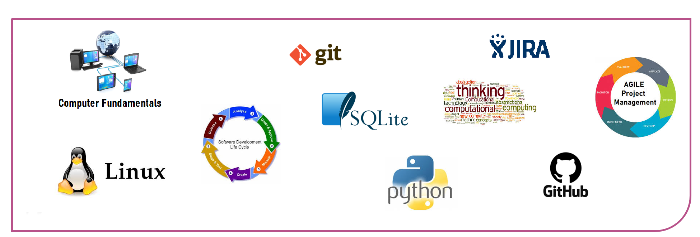

  

<a href="#">My Resume</a>

   Hello,I'm Tolga

        <table>
            <tr>
                <td>🏠 I’m currently living at Manisa, in Turkey</td>
            </tr>
            <tr>
                <td>
👨‍💻 I'm currently learning software at <a href = "https://clarusway.com" target = "_blank"> Clarusway </a>.</td>
            </tr>
        </table>

    

<h2>🛠 &nbsp;Tech Stack</h2>

 

<h2> Connect with me  </h2>

  

